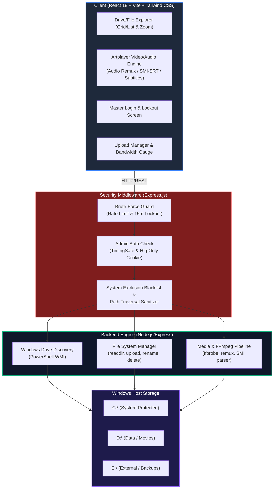
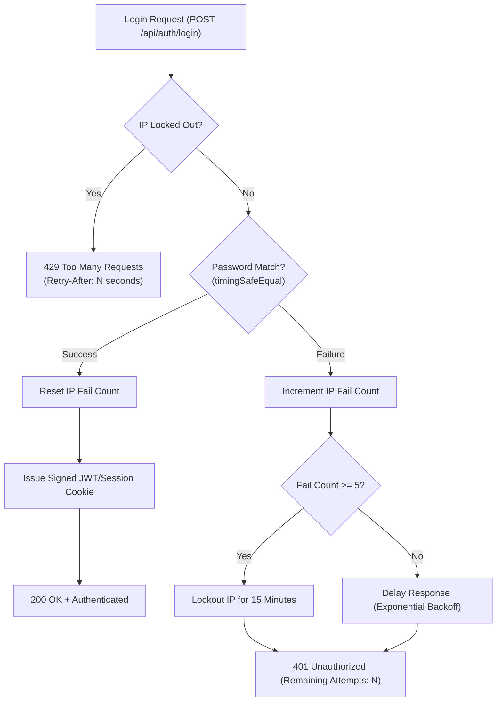
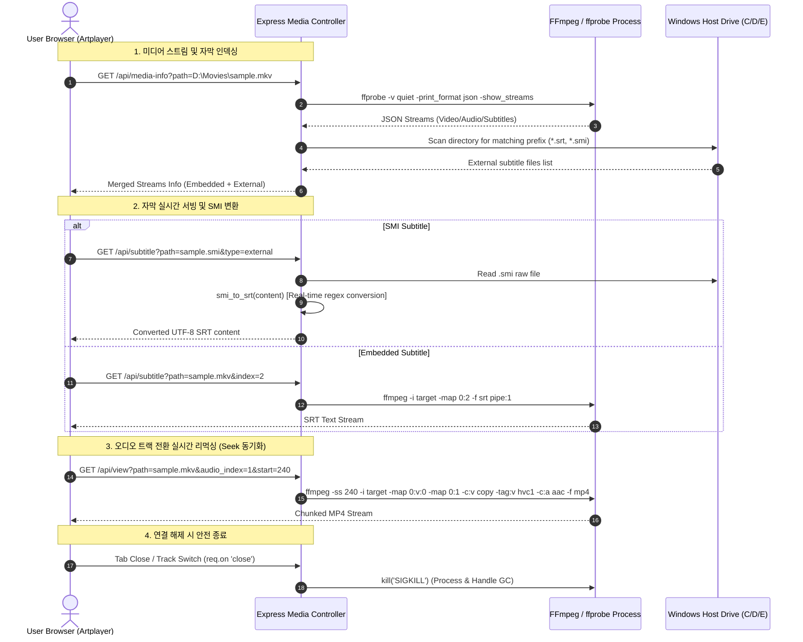

# 📑 Universal React NAS Engine 상세 계획 및 설계서 (PLAN.md)

## 1. 프로젝트 개요

본 프로젝트는 Windows 호스트 환경에서 동작하는 **범용 웹 NAS(Network Attached Storage) 엔진**을 구축하는 프로젝트입니다.  
기존 프로젝트 2건:
1. `digital8150/web-drive-project` (Node.js/Express + FFmpeg)
2. `digital8150/webprogramming-mydrive` (PHP + MySQL + FFmpeg + SAMI 파서 + JWT)

위 두 프로젝트의 핵심 기능(실시간 리먹싱 스트리밍, 다중 오디오/자막 트랙, SAMI 자막 변환, Artplayer 최적화, 반응형 UI)을 총집약하고, **React + Tailwind CSS** 기반 현대적 SPA로 전면 리팩토링합니다. 또한 기존의 단일 업로드 폴더 제한을 풀어 **시스템 내 모든 드라이브(C:, D:, E: 등)**를 웹에서 안전하게 탐색·관리할 수 있도록 확장합니다.

---

## 2. 기존 프로젝트 분석 및 고도화 재활용 요소

### 2.1. Express 기반 `web-drive-project`에서 계승할 핵심 요소
- **초고속 HTTP 206 Range 스트리밍**: 대용량 비디오의 청크 단위 즉각 스트리밍 및 자유로운 Seek.
- **FFmpeg 온더플라이 리먹싱 스트리밍**:
  - `-c:v copy` (비디오 인코딩 부하 제거, CPU 점유율 최소화)
  - `-tag:v hvc1` (Apple Safari / Edge 등 브라우저 네이티브 HEVC 재생 태그 강제)
  - `-c:a aac -b:a 192k -ac 2` (비호환 다채널 오디오 DTS/AC3/TrueHD를 브라우저 호환 스테레오 AAC로 실시간 변환)
  - `-movflags frag_keyframe+empty_moov+default_base_moof+omit_tfhd_offset`
  - `-preset ultrafast -tune zerolatency`
  - 클라이언트 연결 해제(`req.on('close')`) 시 FFmpeg 프로세스 즉각 `kill`하여 서버 리소스 보호.

### 2.2. PHP 기반 `webprogramming-mydrive`에서 계승할 고도화 요소
- **SAMI(`.smi`) → SRT 실시간 변환 파서 (`smi_to_srt`)**:
  - 한국어 미디어 환경에서 가장 빈번한 `.smi` 자막의 `<SYNC Start=...>` 타임코드 및 태그를 완벽 파싱하여 표준 WebVTT/SRT로 실시간 온더플라이 변환.
- **다국어 외부 자막 자동 매칭 (`prefix*.srt`, `prefix*.smi`)**:
  - 영상 파일명과 매칭되는 모든 언어별 외부 자막(`movie.ko.srt`, `movie.en.srt`, `movie.smi`) 자동 감지 및 플레이어 목록 주입.
- **Artplayer 렌더링 최적화 패치**:
  - **Chrome QHD+ 풀스크린 버그 방지**: 전체화면 전환 시 브라우저 그래픽 컴포지터가 자막 레이어를 드롭하는 버그 방지 CSS 인젝션 (`.art-video-player .art-subtitle { visibility: visible !important; }`).
  - **컨트롤 바 연동 자막 유지**: 재생 중 컨트롤 바가 페이드아웃될 때 자막이 함께 사라지지 않도록 위치 고정 및 상태 감시 (`art.on('hide', ...)`).
- **Windows FFmpeg 64KB 파이프 데드락 방지**:
  - Windows의 익명 파이프 버퍼 한계로 인한 FFmpeg 먹통(Hang) 방지: `-loglevel error` 플래그 적용 및 stderr 버퍼 자동 드레인.
- **실시간 업로드 속도 측정 및 대역폭 계산 (`fmtSpeed`)**:
  - 업로드 전송 속도(MB/s, KB/s) 실시간 샘플링 및 세련된 프로그레스 토스트 표시.
- **연속 이미지 갤러리 탐색**:
  - 현재 폴더 내 이미지들을 연속 배열로 캐싱하여 키보드 좌/우 화살표(`ArrowLeft`, `ArrowRight`) 및 내비게이션 버튼으로 즉각 전환.
- **오디오 파일 전용 카드 플레이어**:
  - 음악 파일(`.mp3`, `.flac`, `.aac`, `.wav`, `.m4a`) 재생 시 앨범 아트 및 감성적인 오디오 전용 UI 제공.

---

## 3. 핵심 요구사항 및 아키텍처 다이어그램



---

## 4. 경로 보안 및 시스템 파일 제외 정책 (Security Filter)

### 4.1. 제외(블랙리스트) 대상 목록
Windows 시스템 무결성 유지 및 개인정보 보호를 위해 다음 디렉토리 및 파일은 **목록 노출(readdir) 및 모든 CRUD(읽기/쓰기/스트리밍/다운로드/삭제)에서 원천 차단**됩니다.

1. **C: 드라이브 시스템 및 사용자 보호 디렉토리**
   - `C:\Windows` (하위 전체)
   - `C:\Program Files` 및 `C:\Program Files (x86)`
   - `C:\ProgramData`
   - `C:\Users` (개인 계정 폴더, AppData, 바탕화면, 다운로드 등 개인정보 보호)
   - `C:\Recovery`, `C:\Boot`, `C:\$GetCurrent`, `C:\PerfLogs`
2. **모든 드라이브 공통 시스템/숨김 볼륨 파일**
   - `$RECYCLE.BIN` 및 `$Recycle.Bin`
   - `System Volume Information`
   - 가상 메모리 및 크래시 덤프: `pagefile.sys`, `hiberfil.sys`, `swapfile.sys`, `dumpstack.log.tmp`
   - 파일시스템 메타데이터: `$MFT`, `$LogFile`

### 4.2. Path Traversal 및 안전 경로 검증 로직
```javascript
const path = require('path');

const SYSTEM_EXCLUDES = [
    /^c:\\windows/i,
    /^c:\\program files/i,
    /^c:\\program files \(x86\)/i,
    /^c:\\programdata/i,
    /^c:\\users/i,
    /^c:\\recovery/i,
    /^c:\\perflogs/i,
    /\\\$recycle\.bin/i,
    /\\system volume information/i,
    /\\(pagefile|hiberfil|swapfile)\.sys$/i,
    /\\dumpstack\.log\.tmp$/i
];

function validateAndResolvePath(requestedPath) {
    if (!requestedPath) throw new Error('Path is required');
    
    // 1. 역슬래시 및 정규화
    const normalized = path.normalize(path.resolve(requestedPath));
    
    // 2. 윈도우 드라이브 레터 검증 (예: C:\, D:\)
    const match = normalized.match(/^[a-zA-Z]:\\/);
    if (!match) {
        throw new Error('Invalid drive format');
    }
    
    // 3. 블랙리스트 검사
    for (const pattern of SYSTEM_EXCLUDES) {
        if (pattern.test(normalized)) {
            const err = new Error('Access Denied: Protected System Resource');
            err.statusCode = 403;
            throw err;
        }
    }
    
    return normalized;
}
```

---

## 5. 비밀번호 및 무차별 대입(Brute-Force) 방어 아키텍처



### 5.1. 세부 방어 스펙
1. **타이밍 공격 방지 (Constant-Time String Comparison)**:
   - `crypto.timingSafeEqual(Buffer.from(inputHash), Buffer.from(targetHash))`를 사용하여 문자열 비교 시간에 따른 비밀번호 유추 원천 차단.
2. **IP별 실패 추적 & 15분 자동 잠금 (Lockout)**:
   - 연속 5회 비밀번호 입력 실패 시 해당 IP는 **15분(900초) 동안 자동 잠금**.
   - 잠금 시간 동안 들어오는 요청은 즉각 `429 Too Many Requests`와 함께 잔여 초(Retry-After) 반환.
3. **점진적 응답 지연 (Exponential Backoff)**:
   - 1~4회 실패 구간에서도 응답 지연(500ms, 1000ms, 2000ms...)을 주입하여 초당 대량 공격 무력화.
4. **보안 쿠키 세션**:
   - `HttpOnly`, `SameSite=Strict` 쿠키로 세션 토큰을 관리하여 프론트엔드 XSS 탈취 위협 원천 차단.

---

## 6. 미디어 스트리밍 & 트랜스코딩 파이프라인



---

## 7. 프론트엔드 UI/UX 설계 및 컴포넌트 아키텍처 (React + Tailwind CSS)

### 7.1. 핵심 UI/UX 및 디자인 원칙 (`AGENTS.md` 준수)
1. **백엔드 로직/지시사항 노출 원천 금지 (치명적 실패 기준)**:
   - FFmpeg, 리먹싱, timingSafeEqual, WMI, 블랙리스트 등의 기술적 용어나 개발 지시사항을 프론트 UI 카피에 일절 노출하지 않음. 사용자가 이해하는 직관적이고 표준적인 사용자 언어만 사용.
2. **사용자 중심 화면 구성**:
   - 개발자의 구현 자랑이나 불필요한 개발 메모/디버그 텍스트 배제. 사용자가 파일과 미디어에 집중할 수 있는 깔끔한 제품 환경 제공.
3. **정제된 카피라이팅**:
   - 화면에 들어갈 내용을 스스로 치열하게 고민하고 군더더기를 덜어내어 간결하게 작성.
4. **시각적 공해(Visual Noise) 및 장식 배제**:
   - 있어 보이려고 아이래시, 포인트 텍스트, 캡슐 태그를 과도하게 꽉꽉 채워 화면을 더럽히지 않음. 정돈된 여백과 시각적 위계 중심 설계.
5. **행동 유도 및 필수 안내에 집중**:
   - 사용자의 행동을 변화시키거나 꼭 알려야 하는 핵심 정보만 카피에 포함.

### 7.2. 컴포넌트 구조도
```text
client/src/
├── App.jsx                     # 글로벌 Context Provider 및 라우팅 뷰
├── main.jsx                    # 엔트리포인트
├── index.css                   # Tailwind 스타일 지시문
├── contexts/
│   ├── AuthContext.jsx         # 로그인 상태, Lockout 타이머, 인증 API
│   └── ExplorerContext.jsx     # 현재 드라이브/경로, 파일 목록, 뷰 모드, 줌 레벨
├── components/
│   ├── layout/
│   │   ├── Sidebar.jsx         # 드라이브 목록(C/D/E) 및 파일 분류(사진/영상/문서)
│   │   ├── Header.jsx          # 검색, 줌 슬라이더, 뷰 모드(그리드/리스트), 업로드/새폴더 버튼
│   │   └── SelectionToolbar.jsx# 다중 선택 다운로드/삭제/이름변경 툴바
│   ├── explorer/
│   │   ├── DriveSelector.jsx   # 드라이브 탭 및 사용량 게이지 Bar
│   │   ├── Breadcrumb.jsx      # Windows 경로 내비게이션 바
│   │   ├── FileGrid.jsx        # 유동적 그리드 카드 뷰 (썸네일/아이콘)
│   │   └── FileList.jsx        # 상세 정보 테이블 뷰
│   ├── preview/
│   │   ├── PreviewModal.jsx    # 통합 프리뷰 팝업
│   │   ├── VideoPlayer.jsx     # Artplayer 래퍼 (오디오 트랙/자막 메뉴/풀스크린 패치)
│   │   ├── AudioPlayerCard.jsx # 오디오 전용 앨범 아트 카드 플레이어
│   │   ├── ImageViewer.jsx     # 이미지 갤러리 (키보드 화살표 연속 탐색)
│   │   └── DocumentViewer.jsx  # PDF / TXT 뷰어
│   └── common/
│       ├── UploadToast.jsx     # 업로드 프로그레스 및 대역폭(MB/s) 토스트
│       ├── CustomDialog.jsx    # Alert / Confirm / Prompt 모달
│       └── LockoutScreen.jsx   # 브루트포스 잠금 쿨다운 카운트다운 화면
```

---

## 8. RESTful API 엔드포인트 명세

| Method | Endpoint | Auth | Description |
| :--- | :--- | :--- | :--- |
| `GET` | `/api/auth/status` | Public | 로그인 여부, IP Lockout 상태 및 잔여 시간(초) 반환 |
| `POST`| `/api/auth/login` | Public | 마스터 비밀번호 검증 (Rate Limit & 15분 잠금 적용) |
| `POST`| `/api/auth/logout` | User | 세션/쿠키 파기 |
| `GET` | `/api/drives` | Auth | 시스템 내 모든 마운트된 드라이브 목록 및 용량 정보 |
| `GET` | `/api/files?path=...` | Auth | 지정 경로 파일/폴더 목록 (시스템 제외 정책 적용) |
| `POST`| `/api/upload?path=...`| Auth | 지정 경로 파일 업로드 (Multer 스트리밍) |
| `GET` | `/api/download?path=...`| Auth | 파일 다운로드 |
| `GET` | `/api/media-info?path=...`| Auth | ffprobe 스트림 분석 및 동일 폴더 외부 자막 목록 결합 반환 |
| `GET` | `/api/subtitle?path=...&index=...&type=...` | Auth | 내장 자막 추출 또는 외부 자막(.smi 변환 포함) 서빙 |
| `GET` | `/api/view?path=...&audio_index=...&start=...` | Auth | HTTP 206 Range 스트리밍 또는 온더플라이 리먹싱 스트리밍 |
| `POST`| `/api/mkdir` | Auth | 새 폴더 생성 |
| `POST`| `/api/rename` | Auth | 파일/폴더 이름 변경 |
| `POST`| `/api/delete` | Auth | 파일/폴더 삭제 |

---

## 9. 단계별 구현 로드맵 (Roadmap)

- [x] **Phase 0: 환경 준비 및 프로젝트 기획 (완료)**
  - Git 초기화 및 `.gitignore` 작성
  - 기존 리포지터리 2건(`web-drive-project`, `webprogramming-mydrive`) 소스 분석 및 핵심 기술 파악
  - 시스템 설계 및 세부 기획서(`PLAN.md`, `README.md`) 작성 및 커밋
- [x] **Phase 1: 백엔드 코어 & 보안 엔진 구축 (완료)**
  - Express 서버 구조 설정 (`server/`)
  - Windows 드라이브 자동 감지 서비스 (`driveService.js`, `drives.js`)
  - 시스템 파일 제외 및 Path Traversal 방어 미들웨어 (`pathSecurity.js`, `security.js`)
  - 브루트포스 차단(Rate Limit + 15분 Lockout) & HttpOnly 인증 (`rateLimiter.js`, `auth.js`)
  - 단위 및 E2E API 통합 테스트 스위트 검증 통과 (`phase1-test.js`, `api-test.js`)
- [x] **Phase 2: 파일 관리 & 스트리밍 엔진 이식 (완료)**
  - 파일 브라우징 / 업로드 / 다운로드 / 수정 / 삭제 API (`fileService.js`, `files.js`)
  - FFmpeg 온더플라이 실시간 AAC 리먹싱, 206 Range 스트리밍, ffprobe 분석 (`mediaService.js`, `media.js`)
  - `.smi` → `.srt` 실시간 파서(CP949/EUC-KR 자동 감지) 및 다국어 외부 자막 매칭 로직 탑재 (`subtitleService.js`)
  - Phase 2 종합 테스트 스위트 및 E2E API 통합 검증 완료 (`phase2-test.js`, `api-test.js`)
- [ ] **Phase 3: React + Tailwind CSS 프론트엔드 구축**
  - Vite + React + Tailwind CSS 환경 구성 (`client/`)
  - 탐색기 레이아웃: 사이드바, 드라이브 선택기, 브레드크럼, 파일 그리드/리스트
  - 줌 슬라이더 및 파일 카테고리 필터링
- [ ] **Phase 4: 미디어 플레이어 & 모달 연동**
  - Artplayer React 컴포넌트화 (오디오 트랙 전환, 자막 선택, 전체화면 버그 패치)
  - 연속 이미지 갤러리 및 오디오 카드 플레이어
  - 실시간 업로드 대역폭(MB/s) 토스트 및 다이얼로그
- [ ] **Phase 5: 통합 검증 및 패키징**
  - C:, D:, E: 실제 드라이브 접근 제어 및 블랙리스트 검증
  - 브루트포스 5회 실패 시 15분 잠금 테스트
  - 전체 시스템 실행 스크립트 작성
