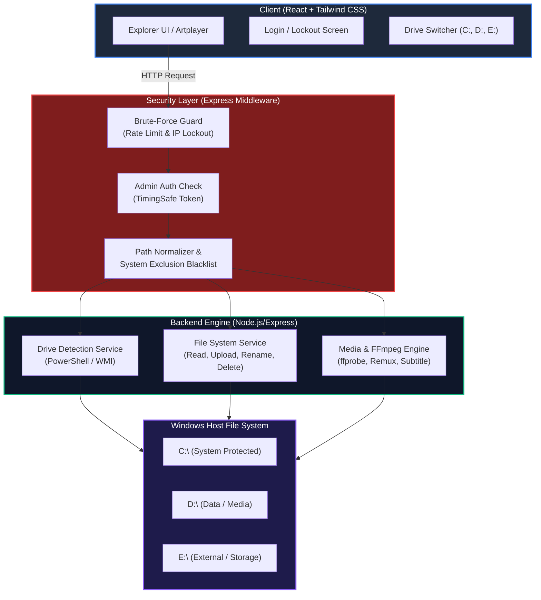
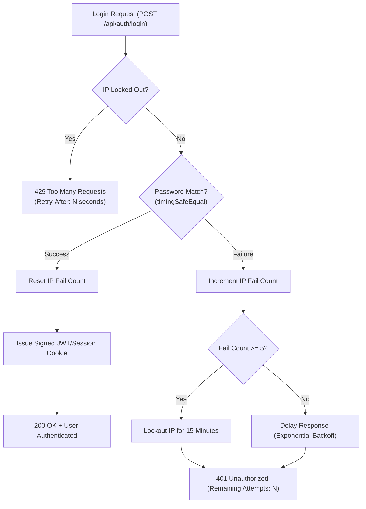
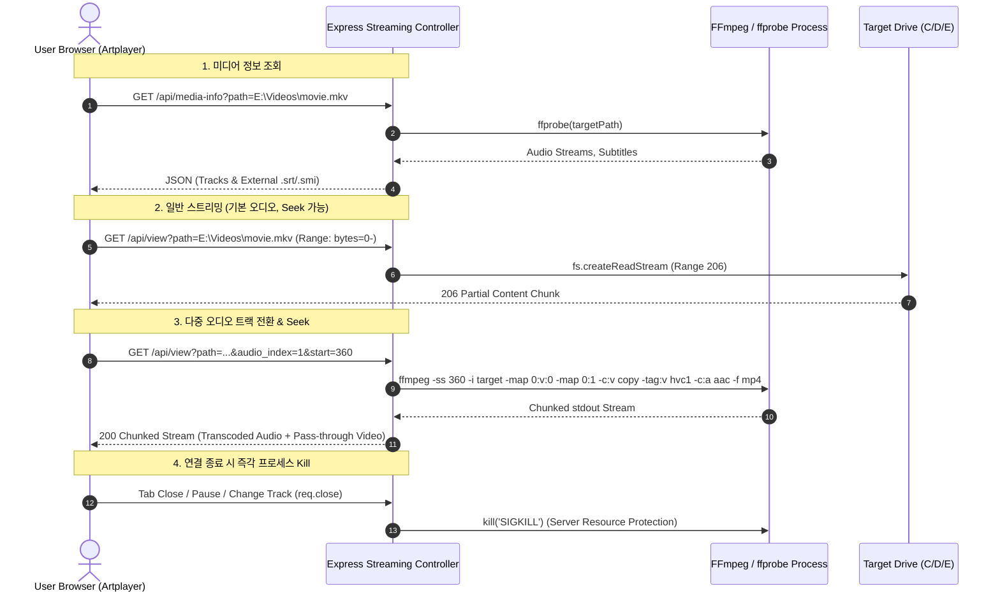

# 📑 Universal React NAS Engine 상세 계획 및 설계서 (PLAN.md)

## 1. 프로젝트 개요

본 프로젝트는 Windows 호스트 환경에서 동작하는 **범용 웹 NAS(Network Attached Storage) 엔진**을 구축하는 프로젝트입니다.  
기존 `web-drive-project`(Node.js/Express + FFmpeg)의 강력한 **온더플라이(On-the-fly) 동영상 스트리밍**과 **반응형 UI 설계**를 계승하고, **React + Tailwind CSS** 기반 현대적 프론트엔드로 전면 리팩토링하며, 기존의 단일 폴더 제한을 풀어 **시스템 내 모든 드라이브(C:, D:, E: 등)**를 웹에서 탐색·관리할 수 있도록 확장합니다.

---

## 2. 핵심 요구사항 및 기술 분석

| 요구 항목 | 세부 요구사항 | 기술적 접근 및 해결책 |
| :--- | :--- | :--- |
| **드라이브 확장** | 시스템 내 모든 마운트된 드라이브(C:, D:, E: ...) 웹 브라우징 | PowerShell WMI (`Get-PSDrive -PSProvider FileSystem` 또는 `wmic logicaldisk`) 또는 Node.js 네이티브/라이브러리(`drivelist` / `node-disk-info`)를 통해 활성 드라이브 자동 감지 및 용량 측정 |
| **시스템 보호 (Exclusion)** | `C:` 드라이브의 시스템 폴더 및 사용자 디렉토리 제외 | 정규화된 절대경로 기준 **블랙리스트 필터링 엔진** 적용 (`C:\Windows`, `C:\Program Files`, `C:\ProgramData`, `C:\Users`, `$Recycle.Bin`, `System Volume Information` 등). 하위 파일 시스템 호출(readdir/upload/stream) 전 단계에서 차단 |
| **프론트엔드 스택** | React + Tailwind CSS + Lucide Icons | Vite 번들러 + React SPA 구조. Tailwind CSS로 기존 LiteDrive 디자인 100% 계승. Artplayer React 래퍼 통합 |
| **보안/인증** | 단일 마스터 비밀번호 + 무차별 대입(Brute-Force) 방지 | 메모리 기반(또는 SQLite) 토큰/세션 + IP별 실패 횟수 카운터, 지수 백오프(Exponential Backoff), 5회 실패 시 15분 잠금(Lockout), `crypto.timingSafeEqual` 사용 |
| **스트리밍 재활용** | 강력한 FFmpeg 스트리밍 엔진 계승 | HTTP 206 Partial Content (초고속 Range 스트리밍) + FFmpeg 실시간 오디오 AAC 리먹싱 (`-c:v copy`, `-c:a aac`, `-ss <seekTime>`) + 내장/외장 자막 추출 파이프라인 유지 |

---

## 3. 시스템 아키텍처 다이어그램



---

## 4. 경로 보안 및 시스템 파일 제외 정책 (Security Filter)

### 4.1. 제외(블랙리스트) 대상 목록
Windows 시스템 무결성 유지 및 개인정보 보호를 위해 다음 디렉토리 및 파일은 **목록 노출(readdir) 및 모든 CRUD(읽기/쓰기/스트리밍/다운로드/삭제)에서 원천 차단**됩니다.

1. **C: 드라이브 시스템 디렉토리**
   - `C:\Windows` (하위 전체)
   - `C:\Program Files` 및 `C:\Program Files (x86)`
   - `C:\ProgramData`
   - `C:\Users` (개인 계정 폴더, AppData, 문서, 바탕화면 등 보호)
   - `C:\Recovery`, `C:\Boot`, `C:\$GetCurrent`, `C:\PerfLogs`
2. **모든 드라이브 공통 시스템/숨김 파일**
   - `$RECYCLE.BIN` 및 `$Recycle.Bin`
   - `System Volume Information`
   - 가상 메모리 및 덤프 파일: `pagefile.sys`, `hiberfil.sys`, `swapfile.sys`, `dumpstack.log.tmp`
   - 볼륨 숨김 파일 및 메타데이터: `$MFT`, `$LogFile`, `desktop.ini`, `Thumbs.db` (설정에 따라 숨김)

### 4.2. Path Traversal 및 안전 경로 검증 알고리즘
```javascript
// pathSecurity.js 개념 설계
const path = require('path');

const SYSTEM_EXCLUDES = [
    /^c:\\windows/i,
    /^c:\\program files/i,
    /^c:\\program files \(x86\)/i,
    /^c:\\programdata/i,
    /^c:\\users/i,
    /^c:\\recovery/i,
    /^c:\\perflogs/i,
    /\\\$recycle\.bin/i,
    /\\system volume information/i,
    /\\(pagefile|hiberfil|swapfile)\.sys$/i
];

function validatePath(targetPath) {
    if (!targetPath) throw new Error('Path is required');
    
    // 1. 역슬래시 및 정규화
    const normalized = path.normalize(path.resolve(targetPath));
    
    // 2. 윈도우 드라이브 레터 검증 (예: C:\, D:\)
    const match = normalized.match(/^[a-zA-Z]:\\/);
    if (!match) {
        throw new Error('Invalid drive format');
    }
    
    // 3. 블랙리스트 검사
    for (const pattern of SYSTEM_EXCLUDES) {
        if (pattern.test(normalized)) {
            throw new Error('Access Denied: Protected System Resource');
        }
    }
    
    return normalized;
}
```

---

## 5. 비밀번호 및 무차별 대입(Brute-Force) 방어 아키텍처



### 5.1. 세부 방어 규칙
1. **타이밍 공격 방지**:
   - `crypto.timingSafeEqual(Buffer.from(inputHash), Buffer.from(targetHash))`를 사용하여 문자열 비교 시간에 따른 비밀번호 유추 방지.
2. **IP별 실패 추적**:
   - 연속 5회 비밀번호 입력 실패 시 해당 IP는 **15분(900초) 동안 자동 잠금**.
   - 잠금 시간 동안 들어오는 요청은 연산 없이 즉각 `429 Too Many Requests` 반환.
3. **지수 딜레이 (Backoff)**:
   - 실패 횟수 1~4회 구간에서도 응답 시간을 점진적으로 지연(500ms, 1000ms, 2000ms)시켜 자동화 툴의 대량 패킷 전송을 무력화.
4. **세션 관리**:
   - `HttpOnly`, `SameSite=Strict` 쿠키 또는 Bearer Token을 사용하며, 브라우저 로컬 스토리지 탈취 위협 감소.

---

## 6. 미디어 스트리밍 & 트랜스코딩 파이프라인 (FFmpeg & Artplayer)

기존 `web-drive-project`에서 검증된 고성능 스트리밍 파이프라인을 그대로 유지 및 확장합니다.



---

## 7. 프론트엔드 React 컴포넌트 구조 (React + Tailwind CSS)

```text
client/src/
├── App.jsx                     # 글로벌 상태 및 레이아웃 컨테이너
├── main.jsx                    # 엔트리포인트
├── index.css                   # Tailwind 지시문 및 커스텀 스크롤바 스타일
├── contexts/
│   ├── AuthContext.jsx         # 로그인 상태, 잠금 카운트다운, 토큰 관리
│   └── ExplorerContext.jsx     # 현재 드라이브/경로, 선택된 파일, 뷰 모드(grid/list), 줌
├── components/
│   ├── layout/
│   │   ├── Sidebar.jsx         # 라이브러리 필터(전체/사진/영상/문서) 및 드라이브 목록
│   │   ├── Header.jsx          # 검색창, 줌 슬라이더, 뷰 모드 토글, 새 폴더, 업로드 버튼
│   │   └── SelectionToolbar.jsx# 다중 선택 시 나타나는 일괄 다운로드/삭제/이름변경 툴바
│   ├── explorer/
│   │   ├── DriveSelector.jsx   # C:, D:, E: 드라이브 전환 바 및 용량 게이지
│   │   ├── Breadcrumb.jsx      # 경로 이동 내비게이션 바
│   │   ├── FileGrid.jsx        # 그리드 카드 뷰 (동적 크기 조절)
│   │   ├── FileList.jsx        # 상세 테이블 뷰 (이름, 크기, 수정일)
│   │   └── FileCard.jsx        # 파일/폴더 개별 아이템 (확장자별 아이콘, 썸네일)
│   ├── preview/
│   │   ├── PreviewModal.jsx    # 통합 미리보기 모달
│   │   ├── VideoPlayer.jsx     # Artplayer React 컴포넌트 (오디오/자막 트랙 셀렉터)
│   │   ├── ImageViewer.jsx     # 고화질 이미지 줌/팬 뷰어
│   │   └── DocViewer.jsx       # PDF / TXT 뷰어
│   └── common/
│       ├── UploadToast.jsx     # 하단 진행률 토스트 (XHR 파일 업로드 프로그레스)
│       ├── ConfirmDialog.jsx   # 삭제/확인 커스텀 다이얼로그
│       └── PromptDialog.jsx    # 이름 변경 / 새 폴더 입력 모달
```

---

## 8. RESTful API 명세서

| Method | Endpoint | Auth | Description |
| :--- | :--- | :--- | :--- |
| `GET` | `/api/auth/status` | Public | 현재 로그인 여부 및 Lockout 남은 시간 반환 |
| `POST`| `/api/auth/login` | Public | 관리자 비밀번호 검증 (Rate Limit 적용) |
| `POST`| `/api/auth/logout` | User | 세션/토큰 무효화 |
| `GET` | `/api/drives` | Auth | 시스템에 마운트된 모든 드라이브 목록 및 용량(Total/Free) 반환 |
| `GET` | `/api/files?path=...` | Auth | 특정 경로의 파일 및 폴더 목록 (시스템 제외 폴더 필터링) |
| `POST`| `/api/upload?path=...`| Auth | 특정 경로에 파일 업로드 (Multer 스트림) |
| `GET` | `/api/download?path=...`| Auth | 파일 다운로드 |
| `GET` | `/api/media-info?path=...`| Auth | ffprobe 기반 오디오/자막 스트림 메타데이터 조회 |
| `GET` | `/api/subtitle?path=...&index=...` | Auth | 비디오 내장 자막 또는 외부(`.srt`, `.smi`) 자막 스트림 추출 |
| `GET` | `/api/view?path=...&audio_index=...&start=...` | Auth | HTTP Range 스트리밍 또는 온더플라이 리먹싱 스트리밍 |
| `POST`| `/api/mkdir` | Auth | 새 폴더 생성 |
| `POST`| `/api/rename` | Auth | 파일/폴더 이름 변경 |
| `POST`| `/api/delete` | Auth | 파일/폴더 삭제 |

---

## 9. 단계별 구현 로드맵 (Execution Roadmap)

- [x] **Phase 0: 환경 준비 및 프로젝트 기획 (현재 단계)**
  - Git 리포지터리 초기화 (`git init`, `.gitignore`)
  - 요구사항 분석 및 기존 코드베이스(Express + FFmpeg + Artplayer) 파싱
  - 시스템 아키텍처 및 세부 설계 마크다운(`README.md`, `PLAN.md`) 작성
- [ ] **Phase 1: 백엔드 코어 & 보안 엔진 구축**
  - Express 서버 구조 셋업
  - Windows 드라이브 탐색 서비스 구현 (`C:`, `D:`, `E:` 감지)
  - `pathSecurity.js` 시스템 제외 및 Traversal 방어 미들웨어 구현
  - `rateLimiter.js` 브루트포스 차단 & 로그인 인증 시스템 구현
- [ ] **Phase 2: 파일 관리 & 스트리밍 엔진 이식**
  - 파일 브라우징 / 업로드 / 다운로드 / 수정 / 삭제 API 완성
  - FFmpeg 리먹싱, Range 스트리밍, ffprobe 메타데이터 및 자막 추출 엔진 이식
- [ ] **Phase 3: React + Tailwind CSS 프론트엔드 구축**
  - Vite + React + Tailwind CSS 환경 구성
  - 드라이브 선택기, 브레드크럼, 파일 그리드/리스트 컴포넌트 개발
  - 기존의 세련된 UI 스타일 및 인터랙션 완벽 이식
- [ ] **Phase 4: 미디어 플레이어 & 모달 연동**
  - Artplayer 기반 비디오 플레이어 React 컴포넌트화
  - 다중 오디오 트랙 전환, 내장/외장 자막 선택 기능 테스트
  - 이미지/문서 프리뷰 및 업로드 프로그레스 토스트 완성
- [ ] **Phase 5: 통합 검증 및 패키징**
  - Windows 실제 드라이브(C:, D:, E: 등) 대상 접근 제어 필터링 검증
  - 브루트포스 잠금 테스트
  - 원클릭 실행 스크립트 작성
